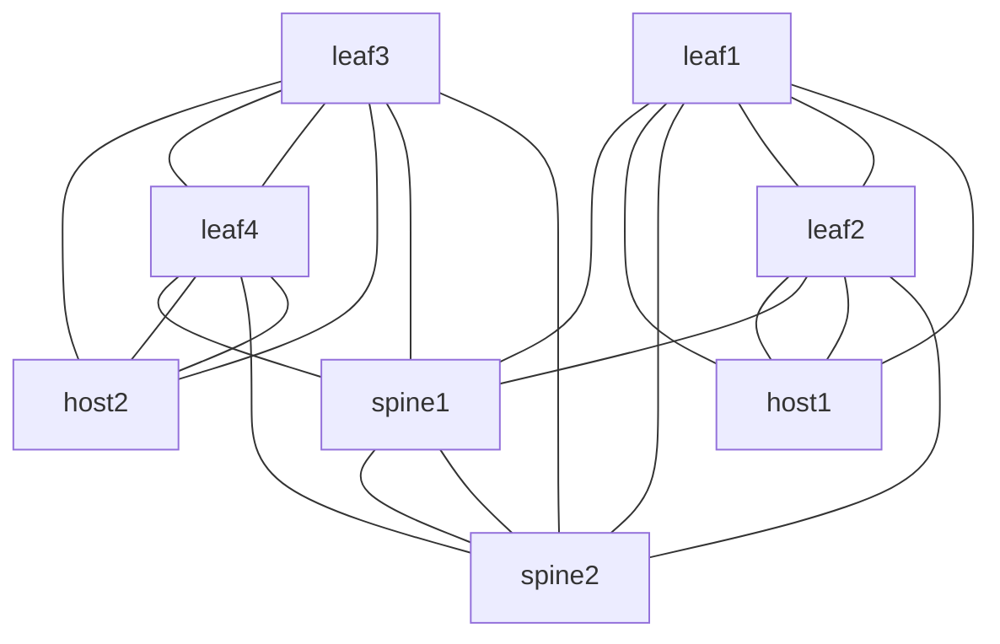

<!--
  ~ Copyright (c) 2024 Arista Networks, Inc.
  ~ Use of this source code is governed by the Apache License 2.0
  ~ that can be found in the LICENSE file.
  -->

> ⚠️ **WIP** ⚠️

# Arista Network Testing Automation (ANTA) demo

This repository is built to support demo about how to use [Arista Network Testing Automation](https://anta.arista.com) framework.

Repository is based on [containerlab](https://containerlab.dev/) for lab management, [eos-downloader](https://github.com/titom73/eos-downloader) for cEOS image management

[Installation process](./docs/installation.md) is provided in this page.

## Latest build

- AVD: v5.1.0
- ANTA: v1.1.0

## Available labs

> **Note**
> Please follow [installation process](./docs/installation.md) first !

1. [Hello World](1-hwllo-world/README.md): Discover and run ANTA
2. [Build your own test](2-custom-test/README.md): Write and execute a custom test
3. [Run ANTA in AVD `eos_validate_state`](3-avd-eos-validate-state/README.md): Demonstrate how to leverage ANTA in AVD

## Containerlab Topology

## Authentication

- Username: **admin** (no password)
- Username: **arista** (password: `arista`)

## Management IPs

| Hostname | Managemnt Interface | IP Address      |
| -------- | ------------------- | --------------  |
| Spine1   | Management0         | 192.168.0.10/24 |
| Spine2   | Management0         | 192.168.0.11/24 |
| Leaf1    | Management0         | 192.168.0.12/24 |
| Leaf2    | Management0         | 192.168.0.13/24 |
| Leaf3    | Management0         | 192.168.0.14/24 |
| Leaf4    | Management0         | 192.168.0.15/24 |
| Host1    | Management0         | 192.168.0.16/24 |
| Host2    | Management0         | 192.168.0.17/24 |

## Contribution

Issues and PRs are welcomed to keep the repo up to date.

## Credits

Initial repository built by [@titom73](https://github.com/titom73)

Maintained by [@gmuloc](https://github.com/gmuloc)
